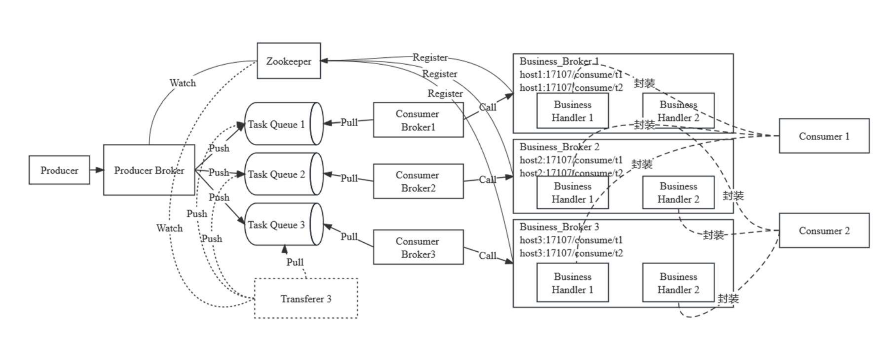
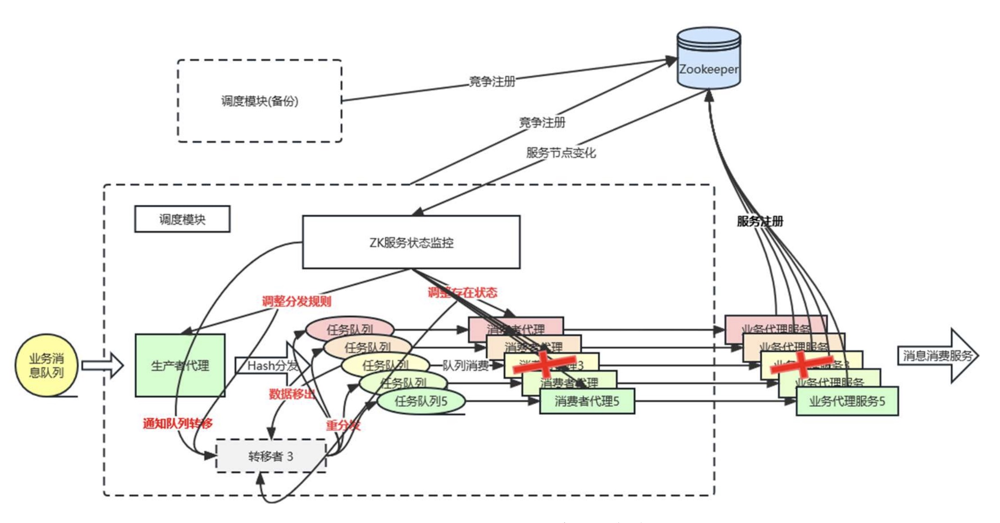

# cool_dispatcher
 A simple message batch scheduling module based on message queue, zookeeper, and python thread operation.

 一个从消息消费业务场景中总结,基于队列组件+zookeeper+python线程操作实现的消息批处理场景调度模块.
 
 
 * 关注消息消费的最终一致性
 * 单机级别的高可用
 * 满足消息保序
 * 对消息消费过程进行简单Flask服务封装
 * 借助zookeeper实现服务状态监控
 * 使用一致性hash环对可变的服务个数进行动态消息分发
 * 辅助说明:
     + 整体结构 
     + 当发生服务崩溃时 

#
 * python 3.6.0
 * 依赖: uhashring/requests/kazoo/redis/Flask, 见req.txt
#
 * config目录(需要定制): 接入所要修改的具体业务配置/参数
 * core: 模块核心逻辑
     + abstract_business_handler: 抽象的业务处理对象
     + abstract_mq_broker: 抽象的子队列处理对象(需要ack机制)
     + dispatcher: 基于zk的服务发现调度流程
     + dispatcher_core: 定义了抽象的MessageWorker,以及全局唯一的MessageProducer,与存活服务一一对应的MessageConsumer,在服务崩溃时转移子队列消息的MessageTransferer
     + business_broker: 基于各个实际Handler,实际启动轻量级web服务的入口
 * implements: 接入所示例的business1/2的handler对象,以及使用redis zset结构来做简单队列的实现
 * starter: 
     + start.sh: 启动脚本,为服务的全局启动. 
     + start_web_service.py: 参数化的启动某一handler对应的多个服务(端口)
     + (start.sh同时启动了调度进程dispatcher.py, 该进程需要启动多个以实现互为主备)
 * utils: 一些用到的工具方法封装
     + common_util: 一些简单的方法封装
     + message_util(需要定制): 针对具体的message进行序列化/反序列化, 消费场景中的对外MQ组件(以QMQ_util的格式为例)
     + watcher_util(需要定制): 监控组件,以statsd为例,可自行调整
     
#
 * 当前仍存在的一些问题: 
     + 动态分发的转移者机制能够适用服务异常的自适应,但不能满足自动扩容场景
